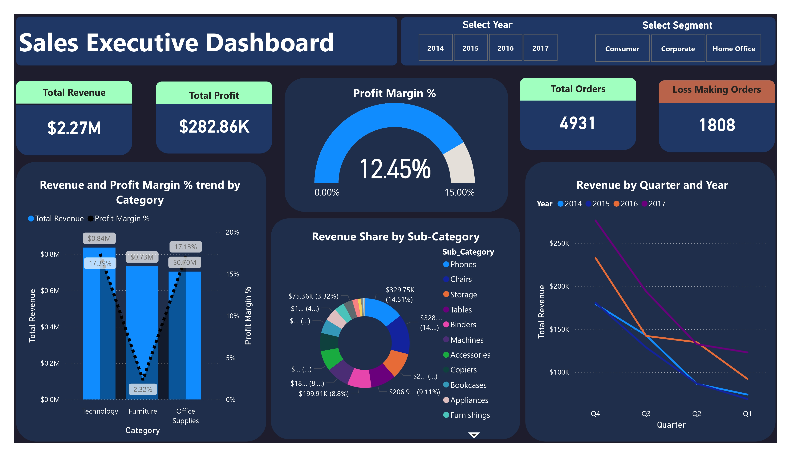
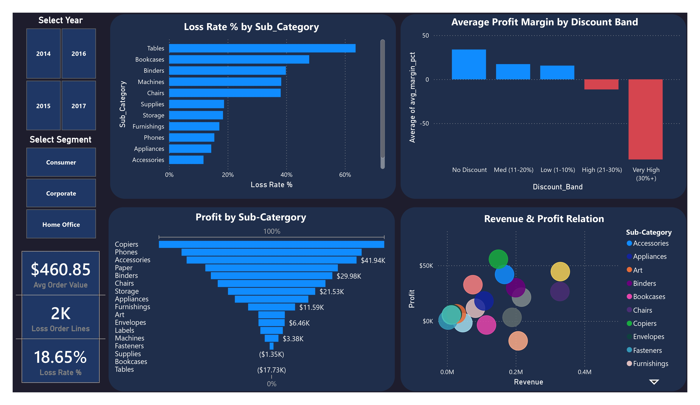
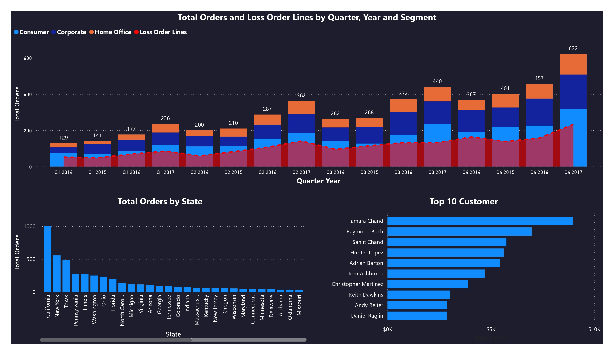

# 🛒 Retail Sales Performance Analysis — Sample Superstore


> **A 3-page interactive Power BI dashboard revealing why a $2.27M revenue business is quietly losing money — and exactly where to fix it.**

---

## 📊 Dashboard Preview

| Page 1 — Executive Overview | Page 2 — Profitability Deep Dive | Page 3 — Customer & Geography |
|---|---|---|
|  |  |  |

---

## 🔍 Business Questions Answered

- Which product categories and sub-categories are profitable vs loss-making?
- Why are 1,808 out of 4,931 orders generating a loss?
- How does discounting strategy directly destroy profit margins?
- Which customers and states drive the most value?
- What is the year-over-year revenue growth trend by segment?

---

## 💡 Key Business Findings

| # | Finding | Impact |
|---|---------|--------|
| 1 | **36% of all orders are loss-making** | 1,808 / 4,931 orders generate negative profit |
| 2 | **Discounts above 30% guarantee losses** | Average profit margin goes deeply negative at 30%+ discount band |
| 3 | **Furniture earns 2.32% margin vs Technology's 17.39%** | Same revenue, 7.5x difference in return |
| 4 | **Tables + Bookcases lose $21,000+** | Despite generating hundreds of thousands in revenue |
| 5 | **California alone drives 20%+ of total orders** | Heavy geographic concentration = revenue risk |
| 6 | **Q4 consistently peaks** | Seasonality is predictable and can be planned for |

---

## 🛠️ Tools & Workflow

```
Raw CSV Data
     ↓
Power Query  →  Data cleaning, calculated columns, fact table creation
     ↓
SQL Server   →  7 analytical queries (window functions, CTEs, RANK)
     ↓
Power BI     →  3-page interactive dashboard
     ↓
DAX          →  10 custom measures (YoY, Running Total, Loss Rate %)
```

---

## 📐 Dashboard Pages

### Page 1 — Executive Sales Overview
- **KPI Cards:** Total Revenue ($2.27M), Total Profit ($282.86K), Total Orders (4,931), Loss Making Orders (1,808)
- **Revenue & Profit Margin % by Category** — Combo chart (bar + line)
- **Revenue by Quarter and Year** — Multi-year line chart showing seasonality
- **Revenue Share by Sub-Category** — Donut chart with value labels
- **Slicers:** Year (2014–2017), Customer Segment

### Page 2 — Profitability Deep Dive
- **KPI Cards:** Avg Order Value ($460.85), Loss Order Lines (2K), Loss Rate % (18.65%)
- **Profit by Sub-Category** — Horizontal bar chart (positive/negative clearly shown)
- **Avg Profit Margin by Discount Band** — THE key insight visual
- **Loss Rate % by Sub-Category** — Identifies the worst offenders
- **Revenue & Profit Scatter** — Relationship view across all sub-categories

### Page 3 — Customer & Geographic Analysis
- **Top 10 Customers by Profit** — Tamara Chand leads at $8.98K
- **Total Orders by State** — California, New York, Texas dominate
- **Orders & Loss Lines by Quarter, Year & Segment** — Full trend breakdown

---

## 📁 Repository Structure

```
superstore-retail-analytics/
│
├── README.md
├── /sql/
│   └── superstore_analysis.sql       ← 7 analytical SQL queries
├── /powerbi/
│   └── superstore_dashboard.pbix     ← Full Power BI file
├── /screenshots/
│   ├── page1_overview.png
│   ├── page2_profitability.png
│   └── page3_customers.png
└── /data/
    └── dataset_source.txt            ← Kaggle source URL
```

---

## 📦 DAX Measures Included

```dax
Total Revenue       = SUM(orders[Sales])
Total Profit        = SUM(orders[Profit])
Profit Margin %     = DIVIDE([Total Profit], [Total Revenue], 0)
Total Orders        = DISTINCTCOUNT(orders[Order ID])
Loss Orders         = CALCULATE(COUNTROWS(orders), orders[Profit] < 0)
Loss Rate %         = DIVIDE([Loss Orders], COUNTROWS(orders), 0) * 100
Avg Order Value     = DIVIDE([Total Revenue], [Total Orders])
Revenue YoY %       = VAR cur = [Total Revenue]
                      VAR prev = CALCULATE([Total Revenue], SAMEPERIODLASTYEAR(DateTable[Date]))
                      RETURN DIVIDE(cur - prev, prev, 0) * 100
Running Revenue     = CALCULATE([Total Revenue], FILTER(ALL(DateTable[Date]),
                      DateTable[Date] <= MAX(DateTable[Date])))
```

---

## 🗄️ SQL Highlights

```sql
-- Discount impact on profit (the key business finding)
SELECT
    CASE
        WHEN discount = 0     THEN '0% - No Discount'
        WHEN discount <= 0.10 THEN '1-10%'
        WHEN discount <= 0.20 THEN '11-20%'
        WHEN discount <= 0.30 THEN '21-30%'
        ELSE '30%+'
    END AS discount_band,
    COUNT(*) AS orders,
    ROUND(SUM(profit), 2) AS total_profit,
    ROUND(AVG(profit / NULLIF(sales, 0)) * 100, 1) AS avg_margin_pct
FROM orders
GROUP BY discount_band
ORDER BY discount_band;
```

---

## 📌 Dataset

- **Name:** Sample Superstore Sales Dataset
- **Source:** [Kaggle — vivek468/superstore-dataset-final](https://www.kaggle.com/datasets/vivek468/superstore-dataset-final)
- **Size:** 9,994 rows, 21 columns
- **Period:** 2014 – 2017

---

## 👤 About

Built as part of a 3-project Data Analyst portfolio demonstrating end-to-end analytics capability across Power Query, SQL Server, Power BI, and DAX.

**Open to freelance data analytics and dashboard projects.**
📩 Connect with me on [LinkedIn](https://www.linkedin.com/in/shaharier--shourov/)

